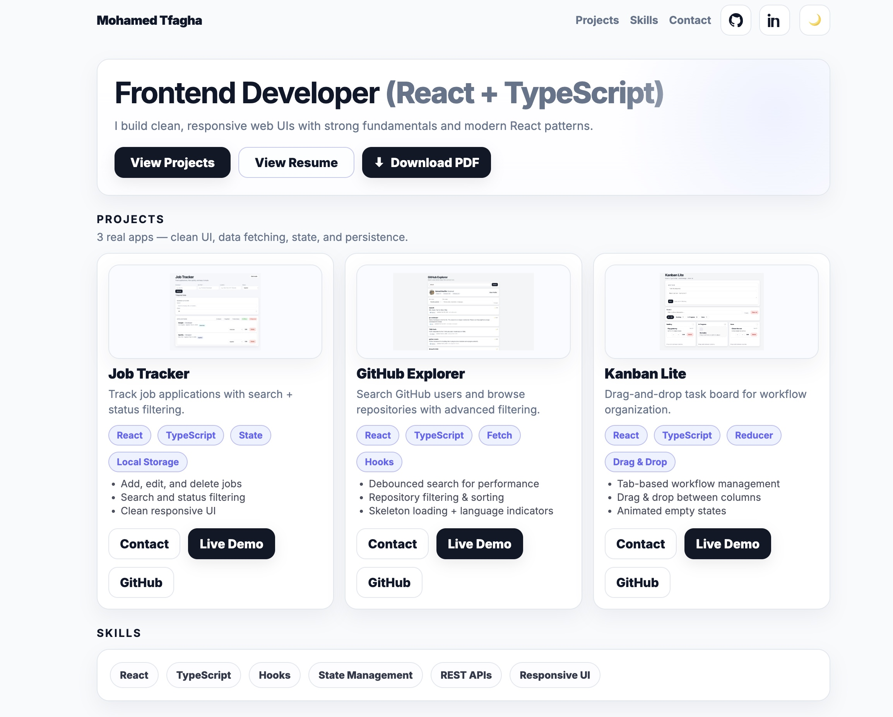

# Mohamed Tfagha — Portfolio

Personal portfolio website showcasing selected projects, skills, and contact links.

---

## 🌐 Live Site
👉 https://mohamedtfagha.vercel.app/

---

## 🖥 Portfolio Preview

<p align="center">
  <a href="https://your-portfolio.vercel.app">
    
  </a>
</p>

---

## 🚀 Projects

### **Job Tracker**
Track job applications with search & status filtering.  
✔ Add/edit/delete applications  
✔ Status workflow & persistence  
✔ Clean responsive UI  

### **GitHub Explorer**
Search GitHub users and explore repositories.  
✔ Debounced search  
✔ Repo filtering & sorting  
✔ Language color indicators  

### **Kanban Lite**
Lightweight kanban board with drag & drop.  
✔ Task workflow management  
✔ Column-based organization  
✔ Smooth interactions  

---

## 🛠 Tech Stack

**Frontend**  
React • TypeScript • Vite  

**UI & Styling**  
Modern CSS • Responsive Design • Dark Mode  

**Architecture**  
Component-driven UI • Local persistence • Data fetching  

---

## 📬 Contact

**Email:** tfagham@gmail.com  
**LinkedIn:** https://linkedin.com/in/mohamed-tfagha-b4a460147  
**GitHub:** https://github.com/Mohamedt19  

---

## ▶ Run Locally

```bash
npm install
npm run dev