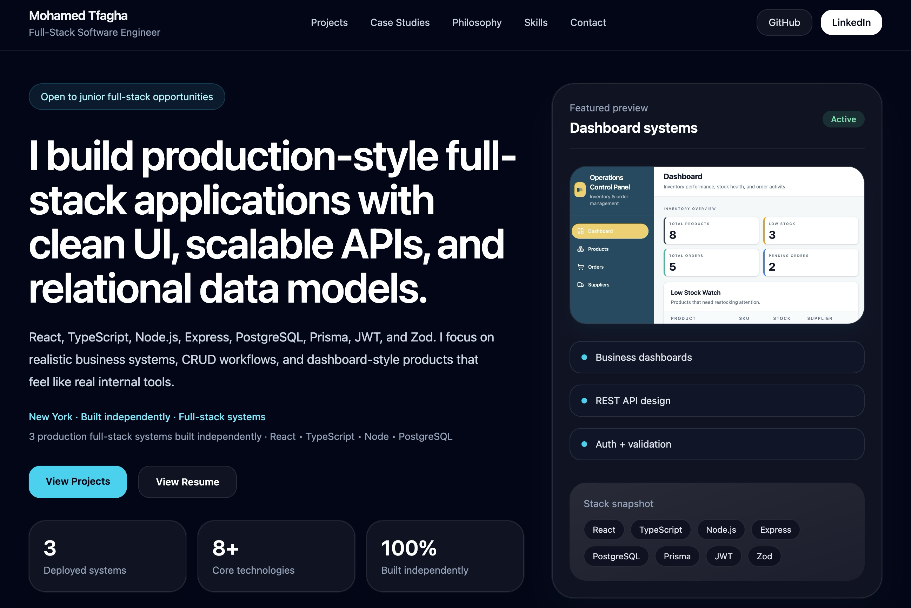

# Mohamed Tfagha — Portfolio

Personal portfolio website showcasing full‑stack business applications, technical skills, and contact information.

---

## Live Site
https://mohamedtfagha.vercel.app/

---

## Portfolio Preview

<p align="center">
  <a href="https://mohamedtfagha.vercel.app/">
    
  </a>
</p>

---

# Featured Projects

## Inventory & Orders Management System

Full‑stack inventory and order management platform for managing products, suppliers, and purchase/sales workflows.

### Stack
React • TypeScript • Node.js • Express • PostgreSQL • Prisma • JWT • Zod

### Key Features
- Product and supplier management
- Inventory tracking
- Order lifecycle management
- Dashboard‑style CRUD workflows
- REST API architecture

### Links
Live Demo  
https://inventory-orders-system-client.onrender.com

Repository  
https://github.com/Mohamedt19/inventory-orders-system

---

## CRM Sales System

CRM application for managing companies, leads, and sales pipeline stages.

### Stack
React • TypeScript • Node.js • Express • PostgreSQL • Prisma • JWT • Zod

### Key Features
- Lead and company relationship management
- Kanban‑style sales pipeline
- Drag‑and‑drop stage updates
- Lead filtering and search
- Dashboard UI for sales metrics

### Links
Live Demo  
https://crm-sales-system-client.onrender.com

Repository  
https://github.com/Mohamedt19/crm-sales-system

---

## Support Ticket System

Helpdesk ticketing system for managing support requests, categories, and issue resolution workflows.

### Stack
React • TypeScript • Node.js • Express • PostgreSQL • Prisma • JWT • Zod

### Key Features
- Ticket creation and lifecycle management
- Priority and status tracking
- Category organization
- Ticket comments and collaboration
- Secure authenticated API endpoints

### Links
Live Demo  
https://support-ticket-system-client.onrender.com

Repository  
https://github.com/Mohamedt19/support-ticket-system

---

# Tech Stack

## Portfolio Website

Frontend
- React
- TypeScript
- Vite
- Tailwind CSS

Deployment
- Vercel

---

## Technologies Used Across Projects

### Backend
- Node.js
- Express
- REST APIs

### Database
- PostgreSQL
- Prisma ORM

### Authentication & Validation
- JWT
- Zod

### Deployment
- Render

---

# Contact

Email  
tfagham@gmail.com

LinkedIn  
https://linkedin.com/in/mohamed-tfagha-b4a460147

GitHub  
https://github.com/Mohamedt19

---

# Run Locally

```bash
npm install
npm run dev
```
